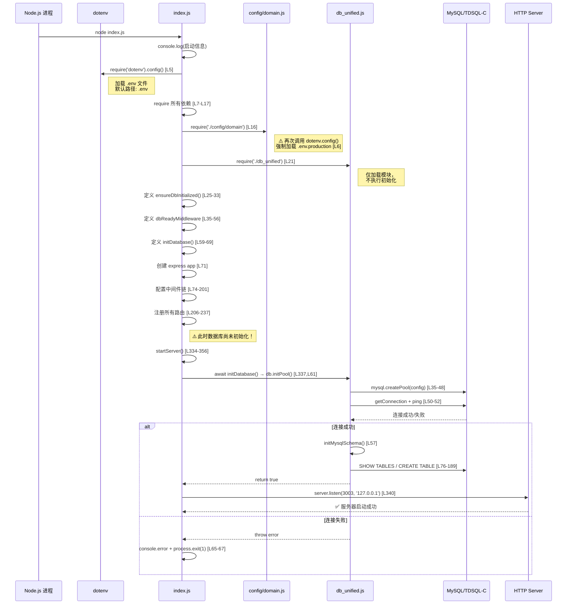
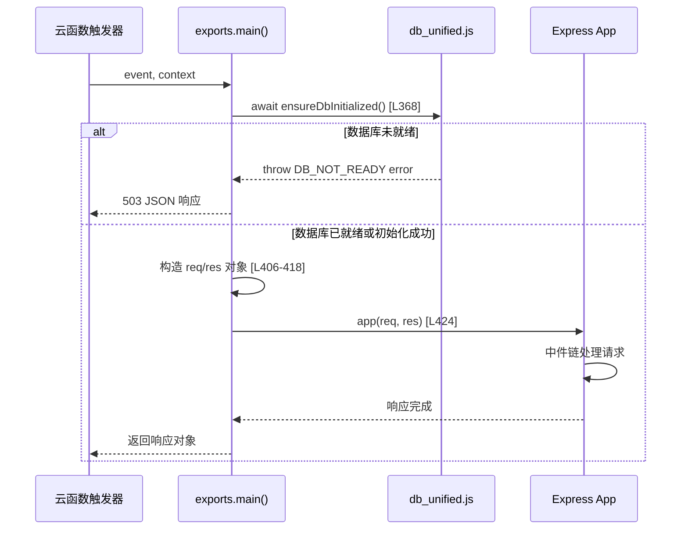
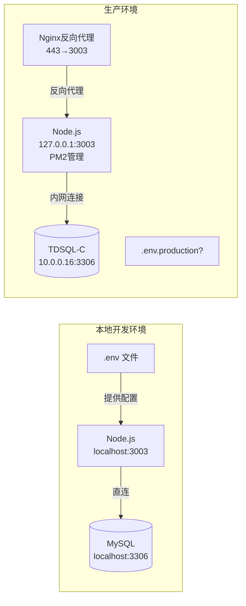

# 绮管电商后台系统 - 架构级深度诊断报告 (Task A1: 系统启动流程端到端审计)

> **审计日期**: 2026-04-15
> **审计范围**: 系统启动序列、数据库初始化时序、模块依赖关系、环境差异分析
> **审计方法**: 只读代码分析，基于实际源码

---

## 一、完整启动流程图

### 1.1 标准启动流程（startServer 路径）



### 1.2 Serverless 启动流程（exports.main 路径 - CloudBase）



---

## 二、require() 调用顺序表（index.js）

| 序号 | 行号 | 模块 | 类型 | 说明 |
|------|------|------|------|------|
| 1 | L5 | `dotenv` | 环境变量 | **首次**加载 .env |
| 2 | L7 | `express` | Web框架 | 核心框架 |
| 3 | L8 | `cors` | 中间件 | 跨域支持 |
| 4 | L9 | `path` | 内置模块 | 路径处理 |
| 5 | L10 | `http` | 内置模块 | HTTP服务器 |
| 6 | L11 | `helmet` | 安全中间件 | 安全头 |
| 7 | L12 | `express-rate-limit` | 限流中间件 | API限流 |
| 8 | L13 | `swagger-ui-express` | API文档 | Swagger UI |
| 9 | L14 | `./config/swagger` | 自定义配置 | Swagger规范 |
| 10 | L15 | `./middleware/auth` | 自定义中间件 | JWT认证 |
| **11** | **L16** | **`./config/domain`** | **自定义配置** | **⚠️ 二次调用 dotenv.config({ path: '.env.production' })** |
| 12 | L17 | `./utils/errorHandler` | 工具模块 | 错误处理 |
| **13** | **L21** | **`./db_unified`** | **核心模块** | **数据库模块（仅加载，不初始化）** |

> **关键发现**: 数据库模块在 L21 被 `require()`，但此时仅执行模块顶层代码（定义变量和函数），**不会自动建立连接**。实际初始化延迟到 `startServer()` 的 `await initDatabase()` (L337)。

---

## 三、核心模块职责说明

### 3.1 index.js — 应用入口与编排器

| 职责 | 实现位置 | 说明 |
|------|----------|------|
| 环境变量加载 | L5 | `dotenv.config()` — 默认加载 `.env` |
| Express应用创建 | L71 | `const app = express()` |
| 中间件配置 | L74-201 | compression, json, cors, helmet, rateLimit, cache, static |
| 路由注册 | L206-237 | 15个路由模块 + dbReadyMiddleware 保护 |
| 数据库初始化协调 | L25-69 | `ensureDbInitialized()`, `initDatabase()`, `dbReadyMiddleware` |
| 服务器启动 | L334-356 | `startServer()` — 先初始化DB再listen |
| Serverless入口 | L366-429 | `exports.main()` — 云函数适配层 |
| 全局错误处理 | L282-318 | AppError / DB_ERROR / 未知错误 三级处理 |

### 3.2 db_unified.js — 统一数据库访问层

| 函数/变量 | 行号 | 职责 | 同步/异步 |
|-----------|------|------|----------|
| `mysqlPool` | L9 | 连接池实例（单例） | — |
| `isInitialized` | L11 | 初始化状态标志 | — |
| `initError` | L12 | 上次初始化错误 | — |
| `initPromise` | L10 | 并发控制锁（Promise缓存） | — |
| `initDatabase()` | L14-31 | **初始化入口**（带去重锁） | async |
| `_doInit()` | L33-70 | **实际初始化逻辑** | async |
| `initMysqlSchema()` | L72-197 | 表结构初始化（建表+种子数据） | async |
| `ensureReady()` | L243-260 | 使用前检查DB是否就绪 | async |
| `isDbReady()` | L262-264 | 同步检查DB状态 | sync |
| `query()/getOne()/execute()` | L199-241 | SQL查询封装（自动调ensureReady） | async |
| `initPool()` | L277-280 | 公开API别名 → initDatabase() | async |

### 3.3 config/domain.js — 域名与CORS配置

| 项目 | 说明 |
|------|------|
| **⚠️ 特殊行为** | L6 强制执行 `require('dotenv').config({ path: '.env.production' })` |
| DOMAIN_CONFIG | 主域名/www/api/admin/serverIp/port/protocol |
| CORS_CONFIG | 允许的来源列表 + 方法 + 头部 |
| 输出工具函数 | getApiBaseUrl(), getAdminUrl(), getHealthCheckUrl() |

### 3.4 deploy.js — SSH部署脚本

| 步骤 | 说明 |
|------|------|
| PEM密钥权限修复 | `icacls` 修复SSH私钥权限 |
| SFTP上传 | 将前端 dist 目录上传到 `/var/www/admin/dist` |
| 远程命令执行 | `npm install --production` → PM2/node 启动 |
| 健康验证 | `curl -sI http://127.0.0.1` （⚠️ 无端口） |

---

## 四、模块依赖关系图

```mermaid
graph TD
    subgraph "入口层"
        INDEX[index.js<br/>应用入口]
        EXPORTS[exports.main()<br/>云函数入口]
    end

    subgraph "配置层"
        DOTENV[dotenv.config()<br/>.env 加载]
        DOMAIN[config/domain.js<br/>⚠️ 二次dotenv加载]
        SWAGGER[config/swagger.js]
    end

    subgraph "数据库层"
        DB[db_unified.js<br/>统一数据库模块]
        MYSQL[(MySQL/TDSQL-C<br/>10.0.0.16:3306)]
    end

    subgraph "中间件层"
        AUTH[middleware/auth.js<br/>JWT认证]
        EH[utils/errorHandler.js<br/>错误处理]
        DBMW[dbReadyMiddleware<br/>DB就绪检查]
    end

    subgraph "路由层 (15个)"
        R_AUTH[routes/auth.js]
        R_CAT[routes/categories.js]
        R_PROD[routes/products.js]
        R_DASH[routes/dashboard.js]
        R_ORD[routes/orders.js]
        R_USER[routes/users.js]
        R_UPROF[routes/user_profile.js]
        R_CART[routes/cart.js]
        R_CONT[routes/content.js]
        R_SEARCH[routes/search.js]
        R_COUPON[routes/coupons.js]
        R_CPUB[routes/coupons_public.js]
        R_SYS[routes/system.js]
        R_CUST[routes/customers.js]
        R_HEALTH[routes/health.js]
    end

    INDEX --> DOTENV
    INDEX --> DOMAIN
    INDEX --> SWAGGER
    INDEX --> AUTH
    INDEX --> EH
    INDEX --> DB
    INDEX --> R_AUTH & R_CAT & R_PROD & R_DASH & R_ORD & R_USER & R_UPROF & R_CART & R_CONT & R_SEARCH & R_COUPON & R_CPUB & R_SYS & R_CUST & R_HEALTH
    INDEX --> DBMW

    DOMAIN -->|⚠️ 强制加载| DOTENV_PRODUCTION[.env.production]
    DOTENV --> ENV_LOCAL[.env (本地)]

    DB --> MYSQL
    DBMW --> DB

    R_AUTH --> DB
    R_CAT --> DB
    R_PROD --> DB
    R_HEALTH --> DB
    R_CUST --> DB
    R_CART --> DB
    R_USER --> DB
    R_ORD --> DB
    R_SYS --> DB
    R_DASH --> DB
    R_COUPON --> DB
    R_CPUB --> DB
    R_UPROF --> DB
    R_CONT -.-> DB
    R_SEARCH -.-> DB

    EXPORTS --> INDEX
```

---

## 五、"数据库未初始化" 错误追踪

### 5.1 错误抛出位置全景图

```mermaid
flowchart TD
    A[请求到达] --> B{dbReadyMiddleware}
    B -->|isDbReady()=true| C[next() ✅ 正常处理]
    B -->|isDbReady()=false| D[await ensureDbInitialized()]
    D -->|成功| C
    D -->|失败| E[返回503 DB_NOT_READY]

    F[路由处理函数] --> G[调用 query/getOne/execute]
    G --> H[内部调用 ensureReady()]
    H -->|isInitialized=true| I[执行SQL ✅]
    H -->|isInitialized=false| J{有 initError?}
    J -->|是| K["throw '数据库初始化失败'<br/>code: DB_INIT_FAILED"]
    J -->|否| L[尝试 initDatabase()]
    L -->|成功| I
    L -->|失败| M["throw '数据库未初始化'<br/>code: DB_NOT_READY"]

    style K fill:#ff6b6b,color:#fff
    style M fill:#ff6b6b,color:#fff
    style E fill:#ffa94d,color:#fff
```

### 5.2 各位置错误详情

| 触发位置 | 文件:行号 | 错误消息 | code | statusCode | 触发条件 |
|----------|-----------|---------|------|------------|---------|
| dbReadyMiddleware | [index.js:48](file:///E:/1/绮管后台/index.js#L48) | `'数据库未初始化'` 或 `'数据库服务暂时不可用'` | `DB_NOT_READY` | 503 | ensureDbInitialized() 抛异常 |
| ensureReady() - 有历史错误 | [db_unified.js:246](file:///E:/1/绮管后台/db_unified.js#L246) | `'数据库初始化失败 - {initError.message}'` | `DB_INIT_FAILED` | 503 | isInitialized=false 且 initError 非空 |
| ensureReady() - 无历史错误 | [db_unified.js:254](file:///E:/1/绮管后台/db_unified.js#L254) | `'数据库未初始化或连接失败'` | `DB_NOT_READY` | 503 | isInitialized=false 且重新初始化也失败 |
| exports.main | [index.js:379](file:///E:/1/绮管后台/index.js#L379) | `'数据库未初始化'` | `DB_NOT_READY` | 503 | ensureDbInitialized() 在云函数中失败 |
| health.js /db-test | [routes/health.js:40](file:///E:/1/绮管后台/routes/health.js#L40) | `'数据库未初始化，请检查启动日志'` | `DB_NOT_READY` | 503 | isDbReady() 返回 false |
| 全局错误处理器(DB类) | [index.js:298](file:///E:/1/绮管后台/index.js#L298) | `'数据库服务暂时不可用'`(生产) | `DB_ERROR` | 503 | err.code 匹配 DB_NOT_READY 等 |

---

## 六、本地 vs 生产环境差异对比

### 6.1 配置参数对比矩阵

| 参数 | 本地默认值 (.env.example) | 生产环境 (.env.production) | 差异影响 |
|------|--------------------------|--------------------------|---------|
| **DB_HOST** | `localhost` | **`10.0.0.16`** | 🔴 **内网IP，需网络可达** |
| **DB_PORT** | `3306` | `3306` | 一致 |
| **DB_USER** | `root` | **`QMZYXCX`** | 🟡 不同用户名 |
| **DB_PASSWORD** | `(empty)` | **`LJN040821.`** | 🟡 明文密码 |
| **DB_NAME** | `qiguan` / `ecommerce` | **`qmzyxcx`** | 🟡 不同数据库名 |
| **NODE_ENV** | `development` | **`production`** | 🟡 影响错误信息详细度 |
| **PORT** | `3000` | **`3003`** | 🟡 端口不同 |
| **JWT_SECRET** | 占位符 | **真实密钥** | 🟢 正确配置 |

### 6.2 关键架构差异



### 6.3 config/domain.js 的 dotenv 双重加载问题

这是本次审计发现的 **最关键的架构缺陷之一**：

```javascript
// index.js L5 — 第一次加载
require('dotenv').config();  // 默认加载 .env

// ... 中间经过很多 require ...

// config/domain.js L6 — 第二次加载（强制！）
require('dotenv').config({ path: '.env.production' });
```

**时序影响**：
1. `index.js:L5` 先加载 `.env`（如果存在）
2. `index.js:L16` require `config/domain.js`
3. `domain.js:L6` **覆盖性加载** `.env.production`
4. 之后所有 `process.env.*` 读取的值来自 `.env.production`

**这意味着**：即使本地开发环境有 `.env` 文件，也会被 `.env.production` 的值覆盖。如果本地没有运行 TDSQL-C（10.0.0.16），则**本地也无法正常启动**。

---

## 七、可疑点与潜在问题清单（按严重程度排序）

### 🔴 P0 — 致命问题（必须立即修复）

#### 可疑点 #1: config/domain.js 强制加载生产环境配置
- **严重程度**: **P0**
- **位置**: [config/domain.js:6](file:///E:/1/绮管后台/config/domain.js#L6)
- **问题描述**: `require('dotenv').config({ path: '.env.production' })` 无条件执行，无论当前是开发还是生产环境
- **影响范围**: 全局 — 所有通过 `process.env` 读取的配置都会被 `.env.production` 覆盖
- **复现场景**: 本地开发时如果无法连接到 `10.0.0.16:3306` 的 TDSQL-C，启动必然失败
- **根因分析**: 这行代码可能是为了确保生产环境总能获取正确配置而加入的，但忽略了多环境场景
- **建议修复**: 根据 `process.env.NODE_ENV` 条件性加载不同配置文件

#### 可疑点 #2: deploy.js 未部署 .env 文件到服务器
- **严重程度**: **P0**
- **位置**: [deploy.js](file:///E:/1/绮管后台/deploy.js)
- **问题描述**: 部署脚本只上传了前端 `dist` 目录，**没有复制任何 `.env` 文件到服务器 `/www/wwwroot/qiguan/`**
- **影响范围**: 生产环境启动完全依赖服务器上是否已预置正确的 `.env` 或 `.env.production` 文件
- **复现场景**: 如果服务器上的 `.env` 文件被删除、过期或损坏，部署后服务将无法连接数据库
- **代码证据**: deploy.js L45-48 执行远程命令，但无 sftp 上传 .env 的步骤
- **建议修复**: 在 done() 函数中增加 `.env.production` 的 SFTP 上传步骤

#### 可疑点 #3: deploy.js 健康检查端口缺失
- **严重程度**: **P0**
- **位置**: [deploy.js:51](file:///E:/1/绮管后台/deploy.js#L51)
- **问题描述**: `curl -sI http://127.0.0.1` **没有指定端口**，curl 默认使用 80 端口，但应用监听在 **3003** 端口
- **影响范围**: 部署后的健康验证永远无法检测到后端服务，导致部署"假成功"
- **代码证据**: 应为 `curl -sI http://127.0.0.1:3003` 或 `curl -sI http://127.0.0.1:${PORT}`
- **建议修复**: 修正健康检查URL，加上正确的端口号

---

### 🟠 P1 — 严重问题（应尽快修复）

#### 可疑点 #4: 路由模块在数据库初始化前被 require
- **严重程度**: **P1**
- **位置**: [index.js:206-237](file:///E:/1/绮管后台/index.js#L206-L237)
- **问题描述**: 15个路由模块在 `startServer()` 的 `await initDatabase()` **之前**就被 `require()` 加载
- **潜在风险**: 如果任何路由模块的**顶层同步代码**直接或间接调用了需要数据库连接的操作（如读取配置表），将立即抛出异常
- **当前保护机制**: `dbReadyMiddleware` 仅保护运行时的请求处理，不保护模块加载阶段
- **现状评估**: 当前各路由模块使用了懒加载模式（在路由处理函数内 require db），所以目前未触发此问题，但属于**脆弱设计**

#### 可疑点 #5: ensureDbInitialized() 失败后的 Promise 重置逻辑
- **严重程度**: **P1**
- **位置**: [index.js:27-29](file:///E:/1/绮管后台/index.js#L27-L29)
- **问题描述**:
  ```javascript
  dbInitPromise = db.initPool().catch(err => {
    dbInitPromise = null;  // ← 失败后重置为null
    throw err;
  });
  ```
  当 `initPool()` 失败后，`dbInitPromise` 被重置为 `null`。这意味着**每次新请求到达都会重新尝试初始化数据库**，在高并发下可能导致大量重复连接尝试。
- **影响场景**: 数据库暂时不可用时（如重启、网络抖动），每个请求都触发一次完整的连接尝试
- **建议修复**: 引入指数退避重试机制，或在首次失败后设置冷却期

#### 可疑点 #6: exports.main 与 startServer 双路径行为不一致
- **严重程度**: **P1**
- **位置**: [index.js:334-356](file:///E:/1/绮管后台/index.js#L334-L356) vs [index.js:366-429](file:///E:/1/绮管后台/index.js#L366-L429)
- **问题描述**: 存在两条完全不同的启动路径：
  - **标准路径** (`startServer`): `initDatabase()` → 失败则 `process.exit(1)` → 成功才 listen
  - **Serverless路径** (`exports.main`): `ensureDbInitialized()` → 失败返回503 → **不退出进程**
- **风险**: Serverless模式下，如果数据库永久不可达，云函数会持续返回503而不是快速失败，可能产生不必要的计费
- **额外问题**: `exports.main` 中的超时设置为 25000ms (L421)，但没有对数据库初始化做单独的超时控制

#### 可疑点 #7: initMysqlSchema() 种子数据硬编码
- **严重程度**: **P1**
- **位置**: [db_unified.js:181-187](file:///E:/1/绮管后台/db_unified.js#L181-L187)
- **问题描述**: 默认管理员账号密码硬编码为 `admin123`，且每次检测到 users 表为空时都会插入
- **安全风险**: 如果生产环境的 users 表被意外清空，下次启动时会用弱密码重建管理员账号
- **代码证据**:
  ```javascript
  const adminPassword = bcrypt.hashSync('admin123', 10);
  await connection.execute(
    `INSERT INTO users ... VALUES (?, ?, ?, ?, ?)`,
    ['admin', adminPassword, 'admin@qiguan.com', 'admin', 'active']
  );
  ```

---

### 🟡 P2 — 中等问题（建议修复）

#### 可疑点 #8: 无数据库连接重试机制
- **严重程度**: **P2**
- **位置**: [db_unified.js:33-70](file:///E:/1/绮管后台/db_unified.js#L33-L70) (`_doInit()`)
- **问题描述**: `_doInit()` 尝试一次连接，失败即抛出异常。没有重试逻辑、没有退避策略、没有连接超时独立配置
- **影响**: 数据库短暂不可用（如重启、主从切换）会导致服务完全不可用，直到手动重启
- **建议**: 增加 3 次重试 + 指数退避（1s, 2s, 4s）

#### 可疑点 #9: 密码明文存储在版本控制中
- **严重程度**: **P2**
- **位置**: [.env.production:19](file:///E:/1/绮管后台/.env.production#L19)
- **问题描述**: 数据库密码 `LJN040821.` 和 JWT_SECRET 以明文形式存在于 `.env.production` 文件中
- **风险**: 如果该文件被提交到 Git 仓库，凭据将泄露
- **注意**: 需确认 `.gitignore` 是否包含 `.env.production`

#### 可疑点 #10: 服务器绑定地址限制
- **严重程度**: **P2**
- **位置**: [index.js:340](file:///E:/1/绮管后台/index.js#L340)
- **问题描述**: `server.listen(PORT, '127.0.0.1')` 绑定到 localhost
- **影响**: Nginx 反向代理（通常在同一台机器上）可以正常访问 127.0.0.1:3003，但如果部署架构变化（如容器化），可能导致外部无法访问
- **当前评估**: 对于当前的 Nginx + Node.js 同机部署架构，这不是问题

#### 可疑点 #11: db_mysql.js 文件不存在
- **严重程度**: **P2**
- **问题描述**: 任务要求分析的 `db_mysql.js` 文件**不存在于项目中**。实际的数据库模块是 `db_unified.js`
- **可能原因**: 
  - 历史重构中将 db_mysql.js 合并/重命名为 db_unified.js
  - 文档或任务描述过时
- **建议**: 更新项目文档以反映当前的实际架构

#### 可疑点 #12: 连接池配置缺少 acquireTimeout
- **严重程度**: **P2**
- **位置**: [db_unified.js:35-48](file:///E:/1/绮管后台/db_unified.js#L35-L48)
- **问题描述**: mysql2 的 createPool 配置中没有设置 `acquireTimeout`，默认值为 10000ms（10秒）
- **影响**: 当连接池耗尽时，获取连接最多等待10秒。对于高并发场景可能不够灵活
- **建议**: 显式设置 `acquireTimeout: 30000` 并配合适当的 `queueLimit`

---

## 八、为什么本地可能正常但生产失败？— 根因分析

### 8.1 最可能的根因排序

| 排名 | 根因 | 可能性 | 证据强度 |
|------|------|--------|---------|
| **#1** | **config/domain.js 强制加载 .env.production 导致本地也连 10.0.0.16** | ⭐⭐⭐⭐⭐ | 直接代码证据 (domain.js:6) |
| **#2** | **服务器上 .env 文件缺失/损坏/过期** | ⭐⭐⭐⭐⭐ | deploy.js 无部署步骤 |
| **#3** | **生产数据库 10.0.0.16:3306 网络不通** | ⭐⭐⭐⭐ | 内网IP需VPC/安全组配置 |
| **#4** | **数据库用户 QMZYXCX 权限不足或密码变更** | ⭐⭐⭐ | 凭据可能在DB端被修改 |
| **#5** | **TDSQL-C 服务本身宕机或维护中** | ⭐⭐⭐ | 云数据库运维事件 |

### 8.2 典型故障场景还原

#### 场景A: 本地开发突然失败

```
开发者执行: node index.js

时间线:
T+0ms   → dotenv.config() 加载 .env (如果有)
         → require('./config/domain')
         → domain.js: dotenv.config({ path: '.env.production' }) ← ⚠️ 覆盖!
         → process.env.DB_HOST 变成 '10.0.0.16'
         → process.env.DB_USER 变成 'QMZYXCX'
T+100ms → startServer() → initDatabase()
         → db.initPool() → mysql.createPool({ host: '10.0.0.16', ... })
T+5000ms→ ❌ ECONNREFUSED / ETIMEDOUT (本地无法访问 10.0.0.16)
         → [FATAL] Database initialization failed
         → process.exit(1) 💀
```

#### 场景B: 生产部署后服务不可用

```
开发者执行: node deploy.js

时间线:
T+0s    → SSH连接 101.34.39.231 成功
T+5s    → SFTP上传前端dist文件完成
T+10s   → 远程执行: cd /www/wwwroot/qiguan && npm install --production
T+30s   → 远程执行: pm2 start index.js --name backend
T+33s   → 远程执行: curl -sI http://127.0.0.1  ← ⚠️ 端口错误! 应为 :3003
         → curl 返回空或连接拒绝 (因为80端口没服务)
T+35s   → 部署脚本输出 "Visit https://www.qimengzhiyue.cn/admin"
         → 开发者以为部署成功 ✗

实际情况:
→ 服务器上可能没有 .env.production 文件
→ 或者 .env.production 中的 DB_HOST=10.0.0.16 从该服务器无法访问
→ 或者 TDSQL-C 实例已停止/ IP变更
→ 后端进程启动后立即因数据库连接失败而 exit(1)
→ PM2 自动重启 → 再次失败 → 无限循环
→ 用户看到 502 Bad Gateway (Nginx连不上后端)
```

### 8.3 快速诊断命令

在生产服务器上执行以下命令进行确诊：

```bash
# 1. 检查 .env 文件是否存在
ls -la /www/wwwroot/qiguan/.env*
cat /www/wwwroot/qiguan/.env.production 2>/dev/null || echo "❌ .env.production 不存在!"

# 2. 检查数据库连通性
mysql -h 10.0.0.16 -P 3306 -u QMZYXCX -p'LJN040821.' -e "SELECT 1" 2>&1

# 3. 检查后端进程状态
pm2 list 2>/dev/null || ps aux | grep index.js

# 4. 检查后端日志
pm2 logs backend --lines 50 2>/dev/null || journalctl -u qiguan -n 50

# 5. 检查端口监听
ss -tlnp | grep 3003 || netstat -tlnp | grep 3003

# 6. 手动测试健康检查
curl -v http://127.0.0.1:3003/api/v1/health
```

---

## 九、启动时序总结

```
╔══════════════════════════════════════════════════════════════════╗
║                  绮管后台启动时序轴 (标准模式)                     ║
╠══════════════════════════════════════════════════════════════════╣
║                                                                  ║
║  0ms    ████ dotenv.config() → 加载 .env                         ║
║          │                                                        ║
║  5ms    ████ require(express/cors/helmet/...)                    ║
║          │                                                        ║
║  20ms   ████ require('./config/domain')                          ║
║          │   └── ⚠️ dotenv.config('.env.production') 覆盖配置     ║
║          │                                                        ║
║  30ms   ████ require('./db_unified')                             ║
║          │   (仅加载模块，不建立连接)                              ║
║          │                                                        ║
║  50ms   ████ 定义 ensureDbInitialized / dbReadyMiddleware        ║
║          │                                                        ║
║  80ms   ████ new express() + 中件配置                            ║
║          │                                                        ║
║  150ms  ████ require 15个路由模块                                ║
║          │   (⚠️ DB仍未初始化!)                                   ║
║          │                                                        ║
║  200ms  ████ startServer() 开始执行                              ║
║          │                                                        ║
║  200ms  ├──── await initDatabase() ────┐                        ║
║          │                              │                        ║
║  ~5000ms│                    createPool() │                      ║
║          │                    connect+ping │                      ║
║          │                    initSchema() │                      ║
║          │                              │                        ║
║  ~5500ms├──────────────────────────────┤                        ║
║          │                                                              ║
║  5500ms ████ server.listen(3003, '127.0.0.1')  ✅ 服务就绪           ║
║                                                                  ║
║  ⚠️ 如果第200ms~5500ms之间DB连接失败 → process.exit(1) 💀         ║
╚══════════════════════════════════════════════════════════════════╝
```

---

## 十、审计结论与优先修复建议

### 必须立即修复（P0）

1. **修改 [config/domain.js:6](file:///E:/1/绮管后台/config/domain.js#L6)** — 改为条件性加载：
   ```javascript
   if (process.env.NODE_ENV === 'production') {
     require('dotenv').config({ path: '.env.production' });
   }
   ```

2. **修改 [deploy.js](file:///E:/1/绮管后台/deploy.js)** — 增加 .env 部署步骤和修正健康检查端口

3. **验证生产服务器上的 .env 文件** — 确保 `.env.production` 存在且内容正确

### 尽快修复（P1）

4. 为 `ensureDbInitialized()` 增加重试+退避机制
5. 统一 `startServer` 和 `exports.main` 的错误处理策略
6. 移除或强化种子数据的密码安全性

### 建议优化（P2）

7. 增加 `acquireTimeout` 等连接池参数
8. 确认 `.gitignore` 包含敏感文件
9. 考虑引入数据库连接健康检查定时任务

---

*报告生成时间: 2026-04-15 | 审计工具: 架构级静态代码分析 | 分析文件数: 8*
